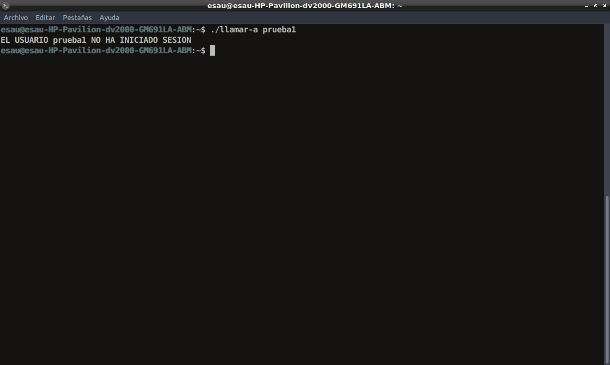
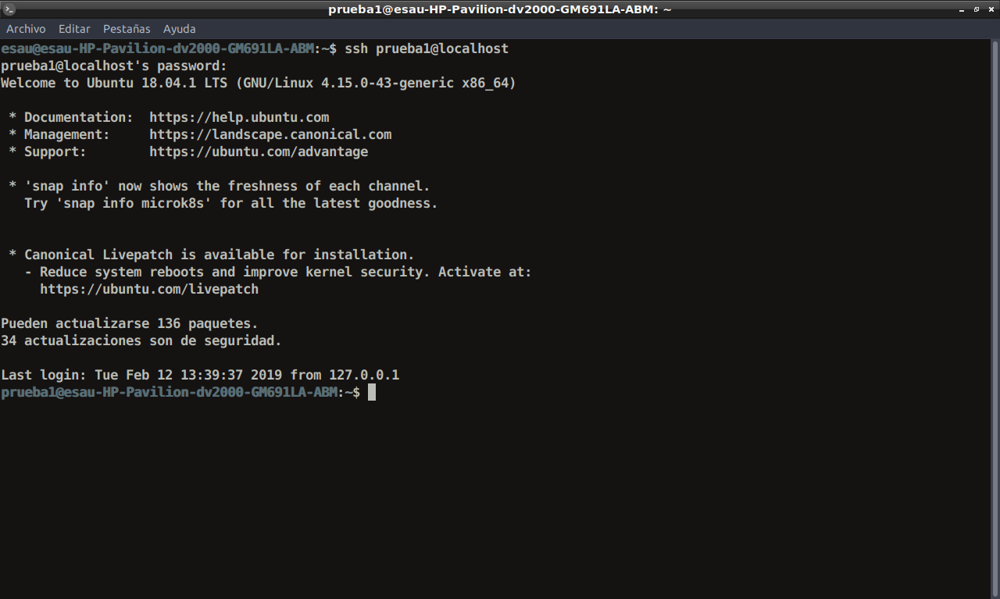
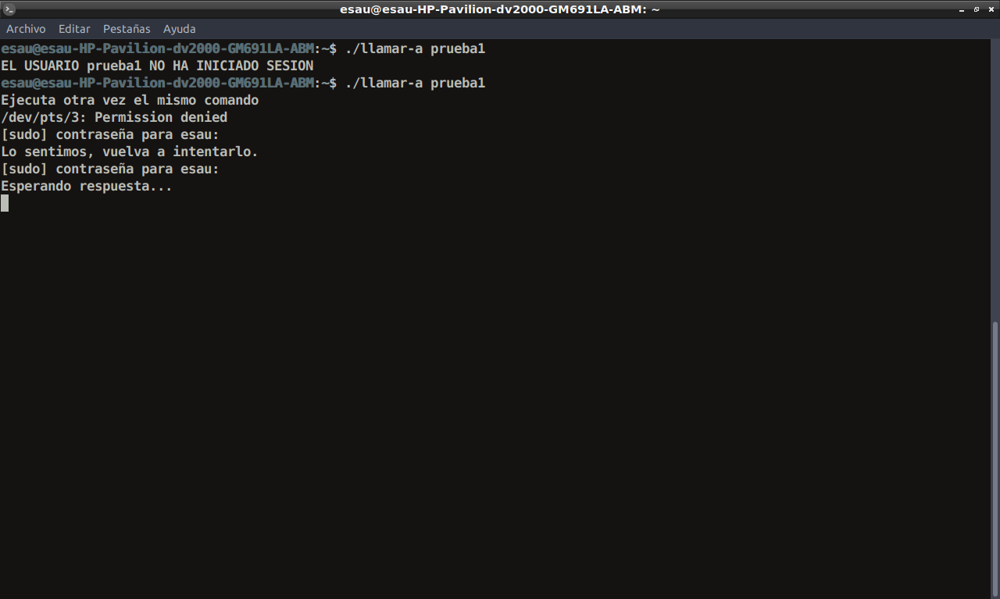
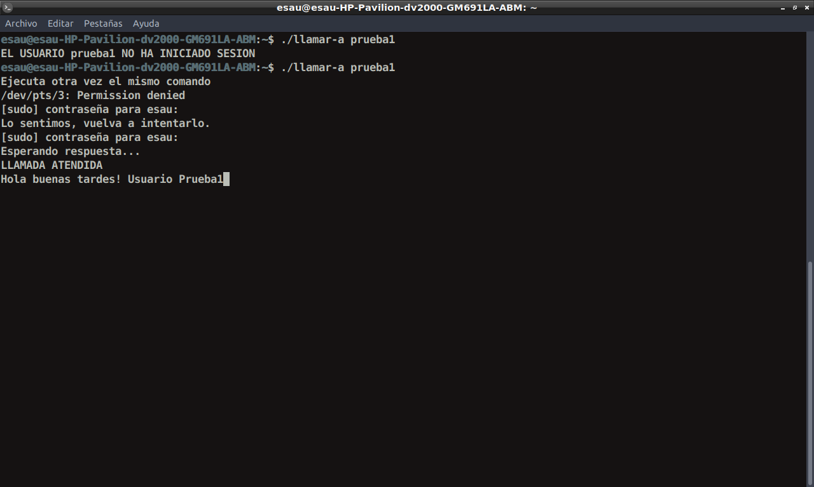
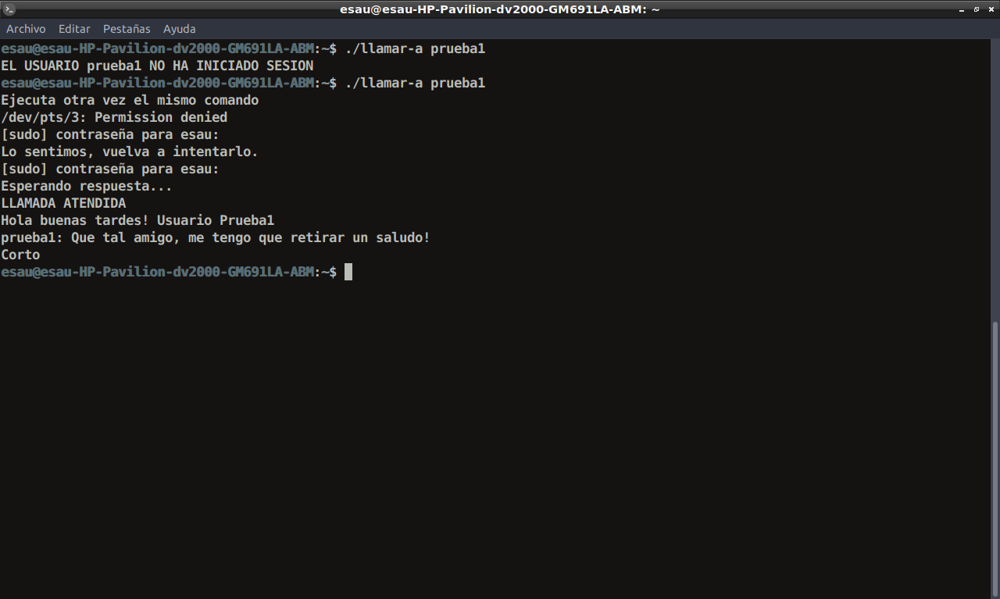
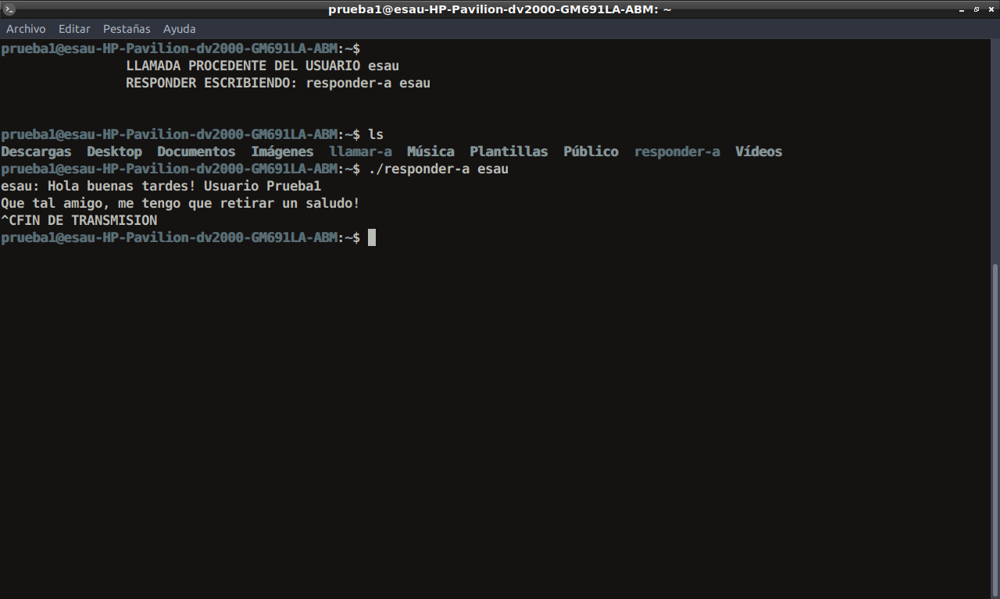

# Communication-between-Unix-Linux-users

[](https://nodesource.com/products/nsolid)

Many years ago, when there was no MSN and not even think about WhatsApp, the administrators of Linux / Unix servers had to have constant communication with the people who were connected to those servers (since they were multi-user systems, users connected through " silly terminals "). The following program is a chat between users of these systems connected to the same server. The base code belongs to the author Francisco Manuel Marquez García, from the book "Unix: Programacion Avanzada".


### Installation

Download the .c files and compile.

```sh
$ gcc -o llamar-a llamar_a_hilos.c -lpthread
$ gcc -o responder-a responder_a_hilos.c -lpthread 
```

### Implementation

```sh
$ ./llamar-a 'USER'
$ ./responder-a 'USER'
```

### Example









[//]: # (These are reference links used in the body of this note and get stripped out when the markdown processor does its job. There is no need to format nicely because it shouldn't be seen. Thanks SO - http://stackoverflow.com/questions/4823468/store-comments-in-markdown-syntax)


   [dill]: <https://github.com/joemccann/dillinger>
   [git-repo-url]: <https://github.com/joemccann/dillinger.git>
   [john gruber]: <http://daringfireball.net>
   [df1]: <http://daringfireball.net/projects/markdown/>
   [markdown-it]: <https://github.com/markdown-it/markdown-it>
   [Ace Editor]: <http://ace.ajax.org>
   [node.js]: <http://nodejs.org>
   [Twitter Bootstrap]: <http://twitter.github.com/bootstrap/>
   [jQuery]: <http://jquery.com>
   [@tjholowaychuk]: <http://twitter.com/tjholowaychuk>
   [express]: <http://expressjs.com>
   [AngularJS]: <http://angularjs.org>
   [Gulp]: <http://gulpjs.com>

   [PlDb]: <https://github.com/joemccann/dillinger/tree/master/plugins/dropbox/README.md>
   [PlGh]: <https://github.com/joemccann/dillinger/tree/master/plugins/github/README.md>
   [PlGd]: <https://github.com/joemccann/dillinger/tree/master/plugins/googledrive/README.md>
   [PlOd]: <https://github.com/joemccann/dillinger/tree/master/plugins/onedrive/README.md>
   [PlMe]: <https://github.com/joemccann/dillinger/tree/master/plugins/medium/README.md>
   [PlGa]: <https://github.com/RahulHP/dillinger/blob/master/plugins/googleanalytics/README.md>
